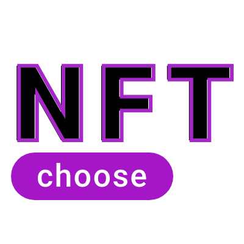

 
 
<h1>Smart Contract Training</h1>

<a href="https://github.com/jeftarmascarenhas/smart-contract-training">Go back to repo</a>

My studies about smart contract with Solidity

See how make each smart contract on my [Youtube channel](https://www.youtube.com/@nftchoose)

Veja como fazer cada smart contract no my
[Canal no YouTube](https://www.youtube.com/@nftchoose)

## Basics (Básico)
- [x] [ Access Control](./basic/access-control/README.md)
- [x] [ Context](./basic/context/README.md)

## Intermediate(Intermediário)

- [x] [ Simple Stake](./intermediate/simple-staking)
- [x] [ Multi Sign Wallet](./intermediate/multi-sign-wallet/README.md)
- [x] [ NFT Full Contract](./intermediate/nft/README.md)
