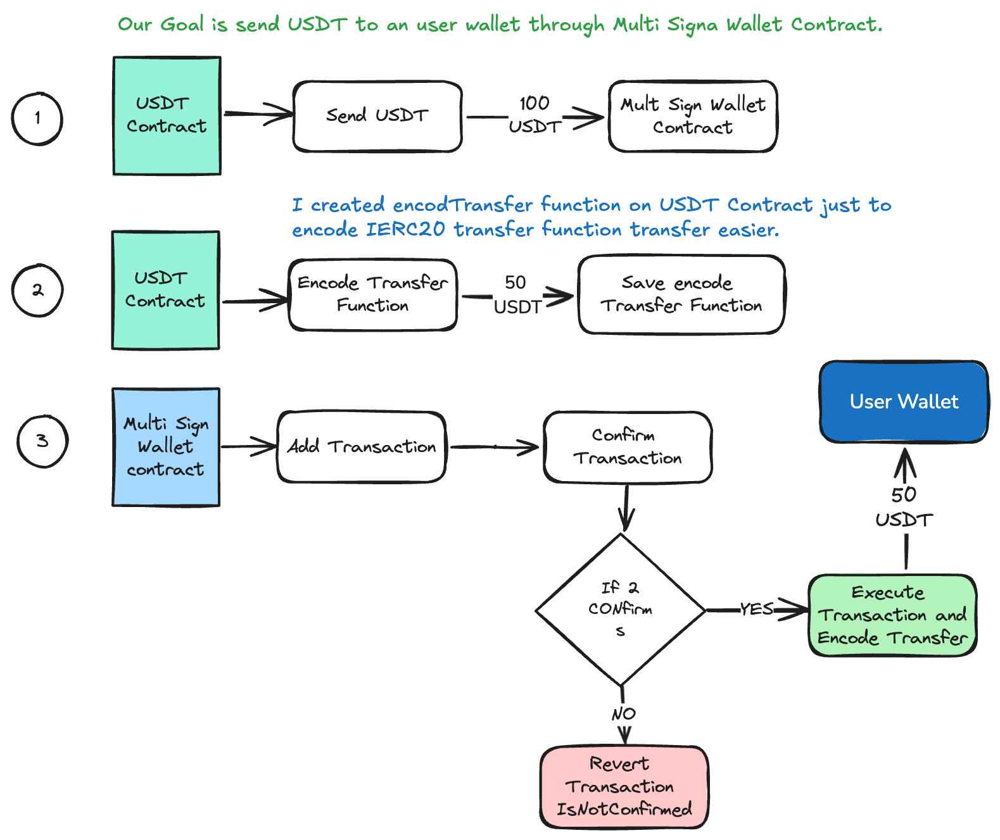

# How to create a Multi Sign Wallet Smart Contract

Multi Sign Wallets are smart contract that allow multiple signers to review and agree on action on the blockchain before action is executed.

For example, a multisign wallet could be used to control ETH, or smart contract, requiring signatures from
at least M of N total signers to execute the action.

See how to make this smart contract [click here](https://www.youtube.com/@nftchoose)

<hr />

How to make a pretty simple Multi Sign Wallet

Veja como fazer este smart contract [click here](https://www.youtube.com/@nftchoose)

## Multi Sign Wallet Interface

```javascript
// SPDX-License-Identifier: MIT
pragma solidity 0.8.24;

/*
    Jeftar Mascarenhas
    twitter: @jeftar
    github: github.com/jeftarmascarenhas
    linkedin: linkedin.com/in/jeftarmascarenhas/
    site: jeftar.com.br
    youtube: youtube.com/@nftchoose
*/
interface IMultiSig {
    // Estrutura que define uma transação a ser executada pela multisig
    struct Transaction {
        address to; // Endereço do destinatário da transação
        uint256 value; // Valor em wei a ser transferido
        bytes data; // Dados adicionais (útil para interagir com outros contratos)
        bool executed; // Indica se a transação já foi executada
    }

    // Erros personalizados para validação e economia de gas
    error NoOwnerAddressesAreSent();
    error RequiredCannotZero();
    error OwnersLengthIsLessThanRequired();
    error RequiredIsGreatThanOwners();
    error CannotZeroAddress();
    error SameAddress(address owner);
    error OnlyOwner(address owner);
    error TransactionIsNotConfirmed();
    error TransactionIdExecuted();
    error TransferFailure();
    error AlreadyConfirmed(uint256 transactionId);
    error ValueCannotBeZero();

    // Eventos para registrar as ações da multisig e proporcionar transparência
    event TransactionAdded(address indexed from, uint256 indexed transactionId);
    event TransactionConfirmed(
        address indexed from,
        uint256 indexed transactionId,
        address indexed owner
    );
    event TransactionExecuted(
        address indexed from,
        uint256 indexed transactionId
    );

    // Funções essenciais para a lógica da multisig
    function transactionCount() external view returns (uint256);

    function addTransaction(
        address to,
        uint256 value,
        bytes calldata data
    ) external returns (uint256);

    function confirmTransaction(uint256 transactionId) external;
}
```

## Multi Sign Wallet Smart Contract

```javascript
contract MultiSig is IMultiSig {
    // Array de endereços dos proprietários da multisig
    address[] public owners;
    // Número mínimo de confirmações necessárias para executar uma transação
    uint256 public required;
    // Total de transações submetidas ao contrato
    uint256 totalTransactions;

    // Mapeia cada transação a partir de seu ID
    mapping(uint256 => Transaction) public transactions;
    // Mapeia quais proprietários confirmaram uma determinada transação
    mapping(uint256 => mapping(address => bool)) public confirmations;
    // Contador de confirmações para cada transação
    mapping(uint256 => uint256) public confirmationCount;
    // Mapeamento que verifica se um endereço é proprietário
    mapping(address => bool) public isOwner;

    // Construtor que inicializa os proprietários e define o número de confirmações necessárias
    constructor(address[] memory _owners, uint256 _required) {
        _initializedOwners(_owners, _required);
    }

    // Função que permite ao contrato receber ETH diretamente
    receive() external payable {}

    // Modificador que garante que apenas um proprietário pode executar certas funções
    modifier onlyOwner() {
        if (!isOwner[msg.sender]) {
            revert OnlyOwner(msg.sender);
        }
        _;
    }

    // Função interna que inicializa os proprietários e valida as entradas
    function _initializedOwners(
        address[] memory _owners,
        uint256 _required
    ) internal {
        if (_owners.length == 0) {
            revert NoOwnerAddressesAreSent(); // Reverte se não houver proprietários
        }
        if (_owners.length < _required) {
            revert OwnersLengthIsLessThanRequired(); // Garante que o número de proprietários seja maior ou igual ao número de confirmações necessárias
        }
        if (_required == 0) {
            revert RequiredCannotZero(); // O número de confirmações necessárias não pode ser zero
        }

        required = _required;

        // Adiciona proprietários e evita duplicações ou endereços inválidos
        for (uint256 i = 0; i < _owners.length; i++) {
            address owner = _owners[i];
            if (owner == address(0)) {
                revert CannotZeroAddress(); // O endereço zero não pode ser proprietário
            }
            if (isOwner[owner]) {
                revert SameAddress(owner); // Proprietários duplicados não são permitidos
            }
            owners.push(owner);
            isOwner[owner] = true;
        }
    }

    // Retorna o número de transações já submetidas
    function transactionCount() external view returns (uint256) {
        return totalTransactions;
    }

    // Função externa que cria e armazena uma nova transação
    function addTransaction(
        address to,
        uint256 value,
        bytes calldata data
    ) external onlyOwner returns (uint256) {
        if (to == address(0)) {
            revert CannotZeroAddress(); // O endereço de destino não pode ser zero
        }
        if (value == 0) {
            revert ValueCannotBeZero(); // O valor da transação não pode ser zero
        }

        // Armazena a nova transação no mapeamento
        Transaction storage transaction = transactions[totalTransactions];
        transaction.to = to;
        transaction.value = value;
        transaction.data = data;

        uint256 transactionId = totalTransactions;

        emit TransactionAdded(msg.sender, transactionId); // Emite um evento ao adicionar a transação

        totalTransactions++; // Incrementa o número total de transações

        return transactionId; // Retorna o ID da nova transação
    }

    // Permite que um proprietário confirme uma transação pendente
    function confirmTransaction(uint256 transactionId) external onlyOwner {
        if (confirmations[transactionId][msg.sender]) {
            revert AlreadyConfirmed(transactionId); // Impede a confirmação duplicada por um proprietário
        }
        confirmations[transactionId][msg.sender] = true; // Marca a transação como confirmada por esse proprietário

        confirmationCount[transactionId] += 1; // Incrementa o número de confirmações

        emit TransactionConfirmed(msg.sender, transactionId, msg.sender); // Emite um evento de confirmação

        if (isConfirmed(transactionId)) {
            executeTransaction(transactionId); // Executa a transação se as confirmações forem suficientes
        }
    }

    // Verifica se uma transação atingiu o número necessário de confirmações
    function isConfirmed(uint256 transactionId) public view returns (bool) {
        return confirmationCount[transactionId] >= required; // Verifica se a transação tem confirmações suficientes
    }

    // Executa uma transação confirmada
    function executeTransaction(uint256 transactionId) public onlyOwner {
        Transaction storage transaction = transactions[transactionId];

        if (!isConfirmed(transactionId)) {
            revert TransactionIsNotConfirmed(); // Reverte se a transação não tiver confirmações suficientes
        }
        if (transaction.executed) {
            revert TransactionIdExecuted(); // A transação não pode ser executada mais de uma vez
        }

        // Executa a transação, enviando o valor para o destinatário
        (bool success, ) = payable(transaction.to).call{
            value: transaction.value
        }(transaction.data);
        if (!success) {
            revert TransferFailure(); // Reverte a execução se houver falha no envio
        }

        transaction.executed = true; // Marca a transação como executada
        emit TransactionExecuted(msg.sender, transactionId); // Emite um evento de execução
    }
}
```

# USDT Mock



```javascript
// SPDX-License-Identifier: MIT
pragma solidity 0.8.24;

import "@openzeppelin/contracts/token/ERC20/ERC20.sol";
import "@uniswap/v3-core/contracts/libraries/TransferHelper.sol";

/*
 * Jeftar Mascarenhas
 * twitter: @jeftar
 * github: github.com/jeftarmascarenhas
 * linkedin: linkedin.com/in/jeftarmascarenhas/
 * site: jeftar.com.br
 * youtube: youtube.com/@nftchoose
 */
contract USDT is ERC20 {
    constructor() ERC20("Theter", "USDT") {}

    function decimals() public view virtual override returns (uint8) {
        return 6;
    }

    /**
     * Send 100 USDT to any wallet or smart contract
     */
    function mint(address account) external {
        _mint(account, 100 * 10 ** 6);
    }

    /**
     * Encode function transfer(address to, uint256 value) external returns (bool);
     */
    function encodeTransfer(
        address to,
        uint256 value
    ) external pure returns (bytes memory) {
        return abi.encodeWithSelector(IERC20.transfer.selector, to, value);
    }
}
```
